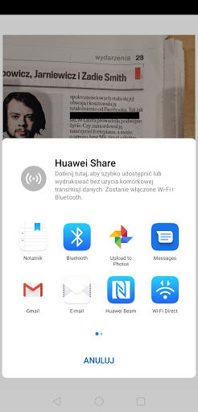

# TextCensor - App to censor text in photos

[Inspiration]

Everyday, we have some information we want to share. 

We want to share we visited a place, our new friends and cool events. We want to share the details, to be helpful and useful to our social group.

However, we also want to respect the privacy of the individual. 

As more attention is paid to privacy, there will be a higher demand for solutions which offer privacy to the user to protect themselves. 

The TextCensor app offers users the ability to easily redact sensitive information from their photos, before sharing them, like the FBI. By using HiAi OCR, the app automatically detects lines of text and the user can censor them with a tap.

This app is especially targeted to women in the age group 25-35, where privacy in the workplace is important, and they want to bring the benefits of privacy to their private life, like lawyers, doctors and special service agents.

## Market Analysis

**Editing with the built in Gallery app**

The app is an improvement to the currently offered solution by the built in photo editing app, which does not utilize OCR to help with redacting text. You have to scrawl over each line with Graffiti, using a fat finger to cover up the text.

[Image censored with the CensorText app]

Above is the first page of apps on google play for the keyword ‘censor’.

1st Row: TV censor sound, face blur, face blur, censor sound, news from ukraine, face censor, 

2nd Row: face censor, censor sound, censor stickers for photos, face censor, censor sound, photo blur,

3rd Row: eye censor bar, face censor, censor stickers, eyes censor, censor stickers, censor sounds.

None of the apps offer OCR to censor text on an image, they focus on the sound or face.

**OCR Apps**

OCR apps offer the function to convert an image into text. This is not ideal when the graphic design element is important in the picture, like a wedding invitation, as a lot of information is lost.

As of writing, the authors were unable to find an app which censors text with OCR and saves the redacted image.

### App Functionality

The user can...

* Load any photo from their gallery

* Detect text in the picture

* Redact chosen line by tapping on it

* Undo redaction by tapping it again

* Save redacted image to gallery

* Sharing redacted images via Huawei Share.

**Demo**

<table>
  <tr>
    <td></td>
     <td></td>
  </tr>
  <tr>
    <td>Home Screen</td>
    <td>Pressed OCR, select an image.</td>
  </tr>
  <tr>
     <td></td>
     <td></td>
  </tr>
  <tr>
    <td>Image Loaded. 
Text automatically bounded with a green box.</td>
    <td>Tapping a box fills it with black, censoring the text. 
Tapping again clears the box</td>
  </tr>
  <tr>
     <td></td>
     <td></td>
  </tr>
  <tr>
    <td>Saved Image has no bounding boxes.</td>
    <td>Share image from within the app.</td>
  </tr>
  <tr>
     <td></td>
      <td></td>
  </tr>
  <tr>
    <td>Shared image from the app has no bounding boxes.</td>
    <td></td>
  </tr>
</table>

### Examples

<table>
  <tr>
    <td></td>
    <td></td>
  </tr>
  <tr>
    <td>Works on Wedding Invitations </td>
    <td>Works on Book Covers</td>
  </tr>
  <tr>
    <td></td>
    <td></td>
  </tr>
  <tr>
    <td>Works on Screenshots</td>
    <td>Kinda works on Pizza Boxes.</td>
  </tr>
</table>

### Future Improvements:

* The user could choose their color of reductions.

* Add face detection with HiAi face detection

* Enable zoom in on image, to easily tap smaller text
